# 🖼️ Processamento e Transformação de Imagens com OpenCV

Notebook desenvolvido para a disciplina **Introdução à Visão Computacional** — PUCRS, Escola Politécnica.

**Autor:** Lucas Leuck de Oliveira
**Professora:** Daniela Oliveira Ferreira do Amaral

> Baseado no [tutorial oficial de equalização de histograma do OpenCV](https://docs.opencv.org/3.4.20/d4/d1b/tutorial_histogram_equalization.html), com comparativos entre o cálculo feito pelo OpenCV e o cálculo aprendido em aula.

---

## 📋 Sobre o projeto

Este notebook (Google Colab) aplica, sobre uma única imagem de entrada, uma sequência de técnicas clássicas de processamento digital de imagens usando **OpenCV**, **NumPy** e **Matplotlib**: desde a leitura da imagem e análise de histograma até equalização adaptativa (CLAHE) e compressão JPEG.

## 🧰 Tecnologias

| Biblioteca | Uso |
|---|---|
| `opencv-python-headless` | Leitura, conversão de cor, threshold, equalização, ruído, compressão |
| `numpy` | Operações matriciais e estatísticas sobre os pixels |
| `matplotlib` | Plot de imagens e histogramas |
| `google.colab` | Montagem do Google Drive e acesso ao arquivo de imagem |

## ▶️ Como executar

1. Abra o notebook no **Google Colab**.
2. Execute a célula de instalação de dependências.
3. Monte o Google Drive e ajuste `caminho_imagem` para o local do seu arquivo `.jpg`/`.png`.
4. Rode as células em sequência — cada seção é independente a partir da imagem original carregada.

---

## 🔎 Etapas e exemplos visuais

### 1. Imagem original

Imagem de entrada usada em todo o notebook, carregada com `cv2.imread`.

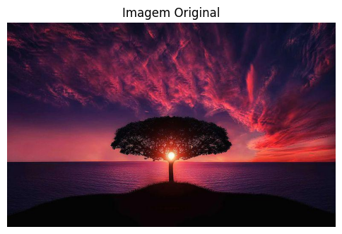

---

### 2. Escala de cinza + Histograma

Conversão para tons de cinza com `cv2.cvtColor` e cálculo do histograma `h(i)` com `cv2.calcHist`, além de medidas estatísticas (média, desvio padrão, mediana, moda, variância).

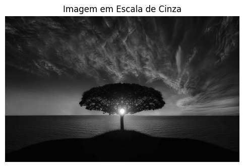
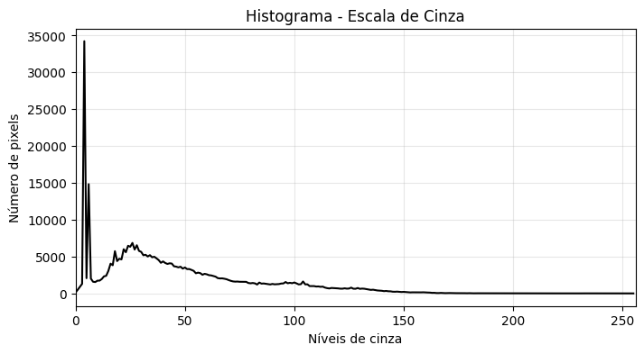

---

### 3. Histograma RGB

Histograma calculado separadamente para os canais **R**, **G** e **B**, com visualização de cada canal isolado.

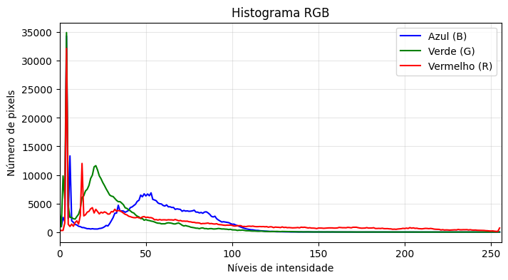
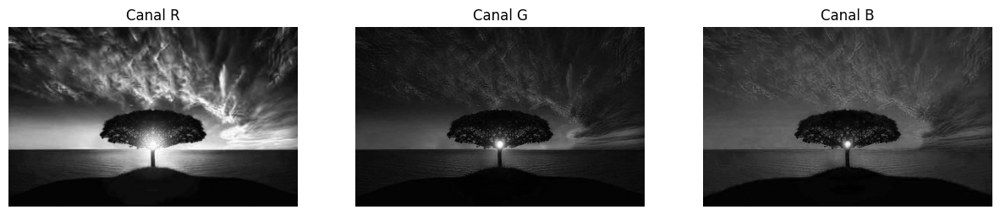

---

### 4. Ruído

Aplicação de ruído **Gaussiano** e **Sal e Pimenta** sobre a imagem em escala de cinza.

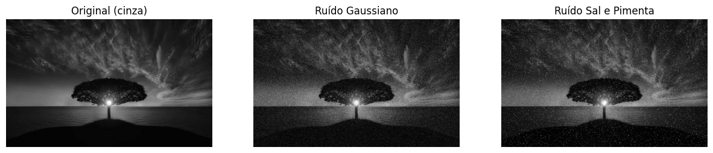

---

### 5. Binarização

Comparação entre threshold **fixo** (limiar = 127) e threshold **automático de Otsu**.

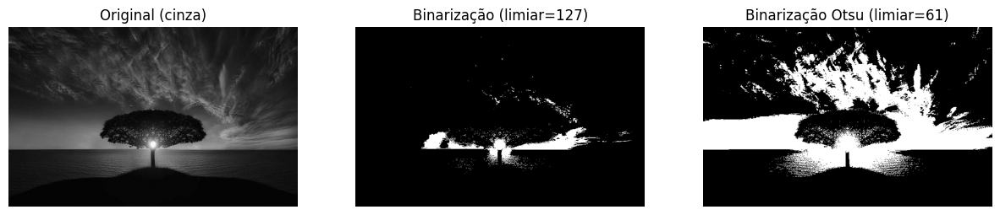

---

### 6. Transformação linear (contraste e brilho)

Aplicação de `g = a·f + b` via `cv2.convertScaleAbs`, controlando contraste (`a`) e brilho (`b`).

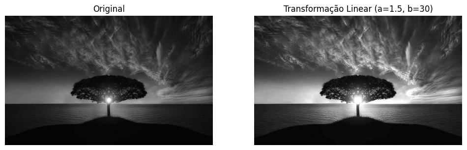

---

### 7. Transformação inversa (negativo)

Caso particular da transformação linear: `g = 255 - f`.

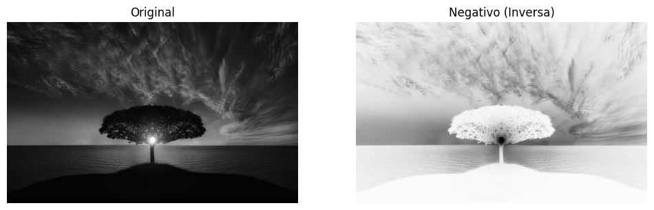

---

### 8. Transformações não lineares

Funções **logarítmica**, **exponencial**, **quadrática** e **raiz quadrada** aplicadas sobre a imagem em cinza.

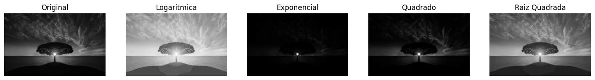

---

### 9. Alargamento de contraste (Contrast Stretching)

Estica os níveis de intensidade para ocupar toda a faixa [0, 255], comparando implementação manual com `cv2.normalize`.

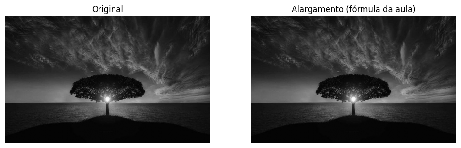

---

### 10. Equalização de histograma

Equalização em escala de cinza com `cv2.equalizeHist` e comparação dos histogramas antes/depois.

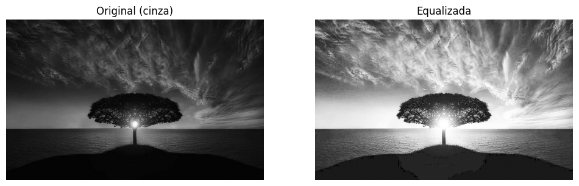
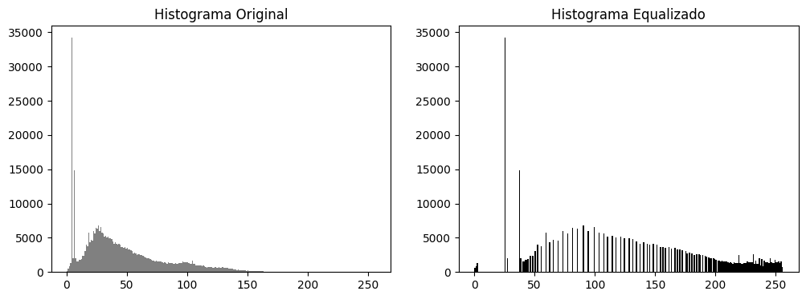

Equalização também aplicada em **imagem colorida**, equalizando apenas o canal de luminância (Y) no espaço YCrCb para preservar as cores originais.

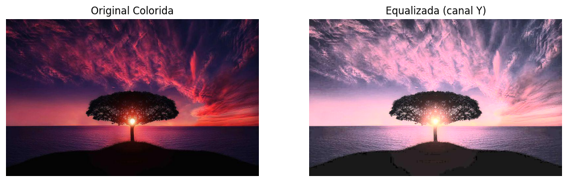

---

### 11. CLAHE (Equalização Adaptativa)

Comparação entre equalização global e **CLAHE** (Contrast Limited Adaptive Histogram Equalization), que evita a super-amplificação de ruído.

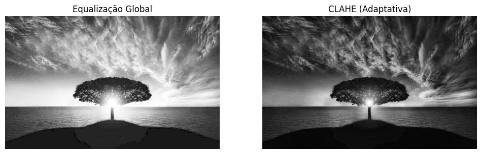

---

### 12. Compressão JPEG

Imagem salva com diferentes níveis de qualidade JPEG (100, 50, 20, 5), comparando tamanho de arquivo × qualidade visual.

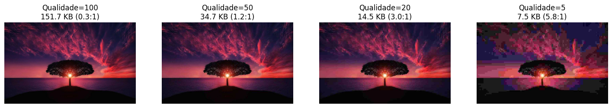

---

## 📁 Estrutura sugerida do repositório

```
.
├── Processamento_Imagens_OpenCV.ipynb
├── README.md
└── assets/
    ├── 01_original.png
    ├── 02_cinza.png
    ├── ...
    └── 16_compressao_jpeg.png
```

## 📚 Referências

- [OpenCV — Histogram Equalization Tutorial](https://docs.opencv.org/3.4.20/d4/d1b/tutorial_histogram_equalization.html)
- Material e slides da disciplina Introdução à Visão Computacional (PUCRS)
